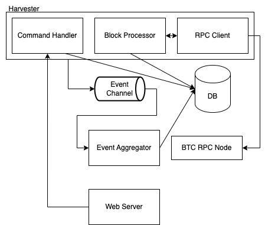

# Bitcoin Indexer Service

## Complete Features

### Basic Requirements

- [✅] Understand Bitcoin Ledger, Transaction and UTXO
- [✅] Differentiate P2TR and other Bitcoin Locking Scripts
- [✅] Design a pipeline that processes Bitcoin ledger (Block ⇒ Transaction ⇒ UTXO ⇒ Balance)
- [✅] Design a scalable RDBMS schema
- [✅] Store Aggregated data, such as Snapshot of Balance, if needed
- [✅] Use de facto standard Bitcoin JSON RPC (QuickNode free tier) for developing and testing

### Feature Requirements

#### Architecture



- Harvester: Main component of the indexer, including the logic to query and process Bitcoin blocks
- Processor: A component from harvester that processes transactions in a block
- RPC Client: A component from harvester that interacts with Bitcoin Node
- Command Handler: A component from harvester that handles the commands from inside and outside
- Aggregator: Aggregate and store events
- Web Server: Handle some queries and CLI commands

### Processing Flow

During normal operation, the system processes new blocks sequentially to maintain the current state of transactions, UTXOs, and balances.

#### Harvester Side

When a new block arrives in sequential order:

1. Block Validation

- Verifies the block is the next in sequence
- Confirms it connects to the previously processed block

2. Block Data Processing

- Stores the new block raw information
- Processes all transactions within the block
- Creates new UTXOs for taproot address from transaction outputs
- Marks spent UTXOs from transaction inputs if exists

3. Notification

- Notifies the Aggregator the events about the new block

#### Aggregator Side

Upon receiving notification of a new block:

1. Event Processing

- Stores events in the database

2. Balance Update(Event Projection)

- Updates account balances based on new events
- Updates account statistics based on new events

3. Coinbase Transaction Handling

- Records new coinbase event into pending table
- Only projects them after cooldown period

#### 3rd party libraries choice

```
Bitcoin Libs:
- bitcoin: Bitcoin Core Libs

Types:
- bigdecimal: Decimal type for financial calculation
- serde_json: Json struct

SQL Libs:
- sqlx: Postgres Lib for query and migration

Web Libs:
- actix-web: Web framework
- reqwest: HTTP client
- serde: Serialize and Deserialize for structs

Error Handling Libs:
- anyhow: Convenient error type
- thiserror: Error type and error handling

Logging Libs:
- log: Logging

Other Libs:
- atb: A tool box for Rust
- tokio: Runtime for async Rust
- once_cell: Once cell pattern for lazy initialization
- futures: Future lib

```

#### Tree Structure

```
├── Cargo.lock
├── Cargo.toml
├── README.md
├── REQUIREMENT.md
├── bin
│   └── bis
│       ├── Cargo.toml
│       └── src
│           ├── api
│           │   ├── bitcoin.rs (Bitcoin routes)
│           │   ├── error.rs
│           │   ├── mod.rs
│           │   └── models.rs
│           ├── cli.rs
│           ├── config.rs
│           ├── main.rs (Main entry)
│           ├── mono.rs (Mono subcommand to start the indexer)
│           └── tools.rs (Tools subcommand)
├── bis.drawio.png
├── core (Shared core libs)
│   ├── Cargo.toml
│   ├── migrations
│   │   ├── 20241119010700_init.sql
│   │   └── 20241120123711_bitcoin.sql
│   └── src
│       ├── bitcoin
│       │   ├── aggregator.rs
│       │   ├── harvester
│       │   │   ├── client.rs (Bitcoin RPC client)
│       │   │   ├── mod.rs
│       │   │   └── processor.rs
│       │   └── types.rs (Domain types)
│       ├── lib.rs
│       ├── rpc_client.rs (Bitcoin inner RPC client)
│       └── sqlx_postgres
│           ├── bitcoin.rs
│           └── mod.rs
├── deployment
│   ├── Dockerfile
│   ├── config.toml (Default config, Mainnet)
│   ├── config_dev.toml (Dev config, Regtest)
│   ├── config_docker.toml (Docker config, Regtest)
│   ├── config_staging.toml (Staging config, Testnet)
│   ├── docker-compose.yaml (Docker compose file)
│   └── k8s-configs (Kubernetes configs)
├── integration-tests
│   ├── Cargo.toml
│   └── src
│       └── lib.rs
├── justfile (Build tool, like Makefile)
└── rust-toolchain.toml

```

### Advanced Requirements

- [✅] Automatically indexing new Bitcoin blocks
- [✅] Multithreading
- [✅] Set up configuration options using configuration file
- [✅] View logs on visualization dashboard (Grafana)
- [✅] Docker Compose
- [✅] Kubernetes
- [✅] Deploy on cloud computing GCP
- [✅] CI
- [✅] CD

### Overall Requirements

- [✅] Testing
- [✅] Containerize

#### Testing

Testcase on regtest:

1. Alice mines 101 blocks
2. Alice send 1 BTC to Bob
3. Alice mines 1 blocks(confrim tx)
4. Alice send 0.5 BTC to Carol
5. Alice mines 1 blocks(confrim tx)

```bash
just local-test
```

Result:

```
    address   |   balance   |  last_updated
------------------------------------------------------------------+-------------+-------------------------------
 bcrt1pk64h4crjqvzwrxttm0j3v73jt6p2s5jlaa9cwddkpvr6puv0qh7qpa4e8v |  4899998450 | 2024-12-01 08:41:26.585399+00
 bcrt1puewuky4wtnnswy3eff34fqlapa54p9dtvg5vvyacpgqgq8anlfsqf20wls | 10000000000 | 2024-12-01 08:41:27.60536+00
 bcrt1p6tk2m9uqs9g8asf8l8d28wp4v8mn5e5k99ncddee52wte2htr6vsrz20up |    50000000 | 2024-12-01 08:41:27.616718+00
 bcrt1py8ttwft6zytdpu9t986egqwnvnmks6qrlj067m9dkrgmef356rcque4mp3 |           0 | 2024-12-01 08:41:27.627634+00
 bcrt1p94eejr3xqc9f3dns0xrmkp0vc7835vhsx8q0atfgcktflp9g880qf3gllz |    49998450 | 2024-12-01 08:41:27.63792+00
```

Note: Each result be compared with the sum of `listunspent` command in Bitcoin Core during test.<br>
Note: addresses are generated randomly, so that column may be different, and the coinbase transaction won't be calculated within 100 blocks.

#### Containerize

Build docker image

```bash
just docker
```

Push docker image to Google Container Registry

```bash
just docker-push
```

Pull docker image from Google Container Registry

```bash
docker pull gcr.io/ivanshyu/bis:latest
```

## Run

### Build in local with docker

#### Start Postgres and Adminer(Visualize DB at http://localhost:8888)

```bash
just local-pg
```

#### (Choose 1 from 3) Start Bitcoin with QuickNode

```
No need to run any container, just use the default config
```

#### (Choose 1 from 3) Start Bitcoin Testnet

```bash
just local-testnet
```

#### (Choose 1 from 3) Start Bitcoin Regtest

```bash
just local-reg
```

To switch the network, go to `Network Config / Environment` for more details.

### Compile & Run

```bash
just local-mono
```

Note:

- `just` is a build tool to simplify the build process like `Makefile` (https://just.systems/man/en/)
- `local-mono` will start the indexer, and auto scan from the `start_block` in the config file. If `start_block` is omitted, it will scan from the newest block queried from the chain.

### CLI

```bash
$ cargo run --bin bis indexer

USAGE:
    bis indexer [OPTIONS] <SUBCOMMAND>

OPTIONS:
    -c, --config-file <CONFIG_FILE>    [env: BIS_CONFIG_FILE=]
    -h, --help                         Print help information
        --host <HOST>                  Host string in "${HOST}:${PORT}" format [env: BIS_HOST=]
                                       [default: 127.0.0.1:3030]
    -V, --version                      Print version information

SUBCOMMANDS:
    help          Print this message or the help of the given subcommand(s)
    pause         Pause the harvester
    resume        Resume the harvester
    scan-block    Scan blocks from `from` to `to`
    terminate     Terminate the harvester
```

For example:

```bash
cargo run --bin bis indexer scan-block --from 1000000 --to 1000001
```

```bash
cargo run --bin bis indexer pause
```

## Network Config / Environment

- (Default) mainnet (./deployment/config.toml)
- testnet (./deployment/config_staging.toml)
- regtest (./deployment/config_dev.toml)

You can set the config file path in `BIS_CONFIG_FILE` environment variable.

Note:

- `magic` is the network magic number of the network to query.
- `provider_url` is the URL of the Bitcoin node to query.
- `start_block` (Optional) is the block number to start the harvester from. If omitted, the newest block queried from the chain will be the `start_block` value.
- `poll_frequency_ms` is the frequency of the harvester to query the chain for new blocks.

database will create `config` table to store and assert the network config to prevent you switch to different network accidentally with existing data.

## API

### Raw APIs

#### Get Latest Block Height

- **GET** `/api/v1/raw/block/latest`
- **Response**

```json
{
    "latest_block_height": block_height
}
```

#### Get Block Data

- **GET** `/api/v1/raw/block/:block_hash`
- **Parameters**
  - `block_hash`: Block hash
- **Response**

```json
{
  "block_header_data": {
    "hash": "00000000000000000002026cd93d61cd31c4c3965a4360ea3acc12f1b3ed2f91",
    "number": 872363,
    "previous_hash": "0000000000000000000251679b57cbde51df3157a321d5b4ef89c733618e33e4",
    "timestamp": "2024-11-28T17:40:46Z",
    "nonce": 3899292546,
    "version": 580239360,
    "difficulty": "102289407543323.79687500"
  }
}
```

#### Get Transaction Data

- **GET** `/api/v1/raw/transaction/:transaction_id`
- **Parameters**
  - `transaction_id`: Transaction ID
- **Response**

```json
{
  "transaction_data": {
    "txid": "659dbccbc615b43c413d44ed74ecfb8b5b1ac85af41c9020a327b63d78f9b0de",
    "block_hash": "00000000000000000002026cd93d61cd31c4c3965a4360ea3acc12f1b3ed2f91",
    "transaction_index": 4,
    "lock_time": 0,
    "version": 1
  }
}
```

### Processed APIs

#### Get Current Balance

- **GET** `/api/v1/processed/p2tr/:p2tr_address/balance`
- **Parameters**
  - `p2tr_address`: Bech32m encoded address
- **Example**
  - `/api/v1/processed/p2tr/bc1qrqp9vfakep7wsze7h62crghz7h0kh5ry3ynf5v/balance`
- **Response** (balance in satoshi)

```json
{
  "curent_balance": "5587366495"
}
```

#### Get UTXOs

- **GET** `/api/v1/processed/p2tr/:p2tr_address/utxo`
- **Parameters**
  - `p2tr_address`: Bech32m encoded address
- **Example**
  - `/api/v1/processed/p2tr/bc1qrqp9vfakep7wsze7h62crghz7h0kh5ry3ynf5v/utxo`
- **Response**

```json
[
  {
    "transaction_id": "07fb318537b62c16d20b0818a1693a509a10bcd7e318bd8add7393892b6d0979",
    "transaction_index": 0,
    "satoshi": "100000000",
    "block_height": 872428
  },
  {
    "transaction_id": "312557e0855cc84b4424b6e073b6d93af404fd22495edc925d7df45df4ffbe5e",
    "transaction_index": 0,
    "satoshi": "5487366495",
    "block_height": 872429
  }
]
```

#### Aggregated APIs

- **GET** `/api/v1/aggregated/p2tr/:p2tr_address`
- **Parameters**
  - `p2tr_address`: Bech32m encoded address
  - `time_span`: Time span for snapshots
    - `m`: Recent Month
    - `w`: Recent Week
    - `d`: Recent Day
  - `granularity`: Snapshot interval
    - `w`: Weekly
    - `d`: Daily
    - `h`: Hourly
- **Example**
  - `/api/v1/aggregated/p2tr/bc1qrqp9vfakep7wsze7h62crghz7h0kh5ry3ynf5v?time_span=w&granularity=d`
- **Response** (Example: 1 Week span with Daily granularity)

```json
{
    "1732341600": [
        {
            "balance": "0"
        }
    ],
    "1732345200": [
        {
            "balance": "0"
        }
    ],
    ...
    ,
    "1732942800": [
        {
            "balance": "5587366495"
        }
    ],
    "1732946400": [
        {
            "balance": "5587366495"
        }
    ]
}
```

## Reorg

### Harvester Side

When the harvester detects that the latest block differs from the previously processed block:

1. Chain Traversal

- Traverses up the block parents until it finds the last matching block
- This block becomes the reorg point

2. Data Cleanup

- Deletes all blocks after the reorg point
- Removes associated transactions (cascading delete)
- Removes associated UTXOs (cascading delete)
- Resets any UTXOs marked as "spent" back to "unspent" state

3. Notification

- Notifies the Aggregator to handle the reorg

### Aggregator Side

Upon receiving the reorg message:

1. Event Processing

- Retrieves all events from the reorganization point
- Inverts the amount for each event (amount \* -1)
- Inserts these as new reorged events into the database

2. Balance Recalculation

- Recalculates and updates all balance-related information
- Aggregates the new balances based on the inverted events

3. Coinbase Cleanup

- Removes any pending coinbase transactions that were waiting for the 100-block cooldown period
- This ensures invalid coinbase transactions are not processed

This process ensures that the system maintains accurate state even when the blockchain undergoes reorganization.

## Graceful Shutdown

Once the indexer is running, you can press `Ctrl+C` or through the CLI `terminate` command to terminate the indexer gracefully, and then the aggregator will be notified and drain all the events in the channel.

- Note: For this project, I didn't implement the recovery behavior for the aggregator because it is stateless(simplify the design), so once aggregator is killed forcefully without processing all the events, the remaining events will be lost without aggregation.
